# Azure VM Lifecycle Automation

A modular and secure automation framework for managing Azure Virtual Machine lifecycle operations using Terraform and Azure Functions.

---

## 📌 Overview

This project implements a production-oriented automation pattern to start and stop Azure Virtual Machines based on tags.

It demonstrates:

- Infrastructure as Code with Terraform  
- Reusable Terraform modules  
- Azure Functions (PowerShell, HTTP-triggered)  
- Managed Identity authentication  
- Least-privilege RBAC  
- Tag-based resource targeting  
- Cold start optimization  

The solution is designed with real-world cost optimization and operational control in mind.

---

## 🎯 Business Problem

In many environments, especially development and staging, Virtual Machines do not need to run 24/7. Leaving them running unnecessarily increases operational costs.

This solution enables:

- On-demand VM lifecycle control  
- Secure automation without stored credentials  
- Cost reduction in non-production environments  
- Scalable and extensible automation architecture  

The implementation focuses on secure design, modularity, and maintainability.

---

# 🏗️ Infrastructure Design

## Terraform Root Module

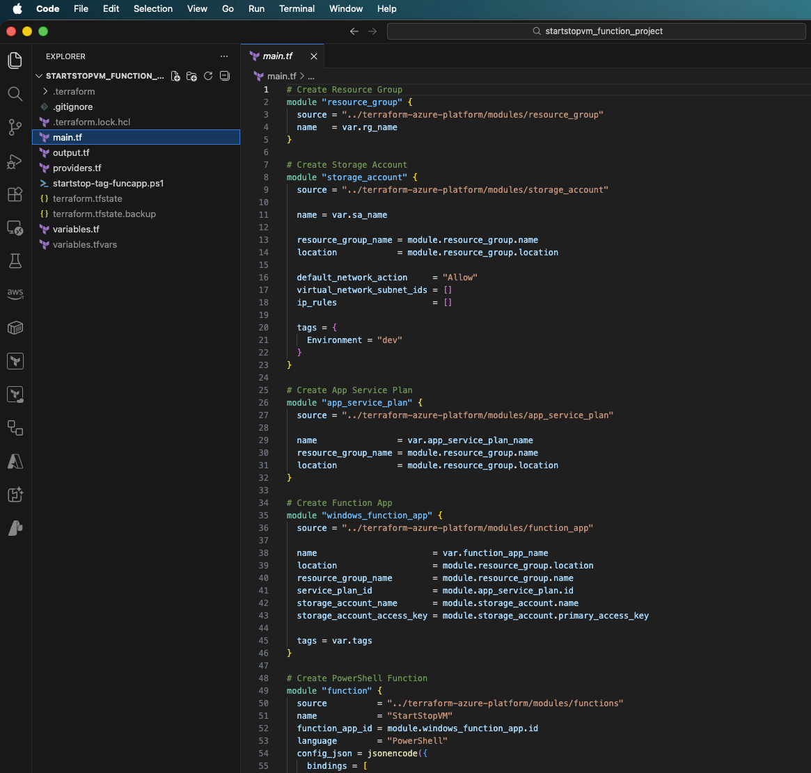

The root module composes infrastructure using reusable child modules instead of duplicating code. This promotes:

- Clean architecture  
- Reusability  
- Version control per module  
- Separation of concerns  

---

## Reusable Terraform Modules

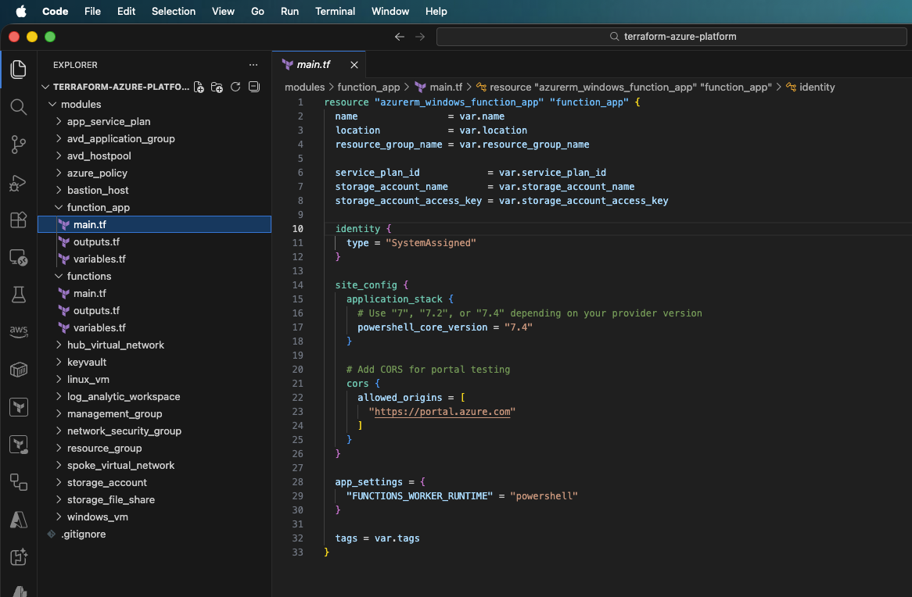

Reusable infrastructure components are maintained in a separate repository:

👉 **[terraform-azure-platform](https://github.com/JcPrince28/terraform-azure-platform.git)**

This mirrors real-world Terraform practices where shared modules are centrally maintained and versioned independently.

---

## Module Composition & Tag Strategy

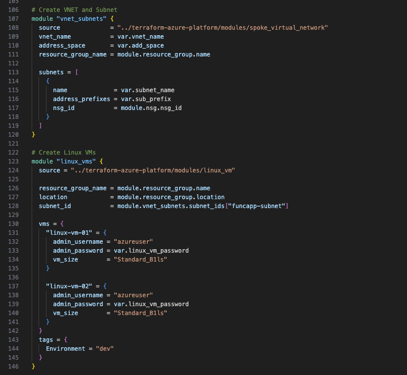

Infrastructure is composed using modular blocks such as:

- `module "linux_vms"`

Tags are injected at deployment time and later used by the automation logic to dynamically target resources.

This avoids hardcoding VM names and enables business-driven control.

---

# ☁️ Azure Deployment

## Resource Group Overview

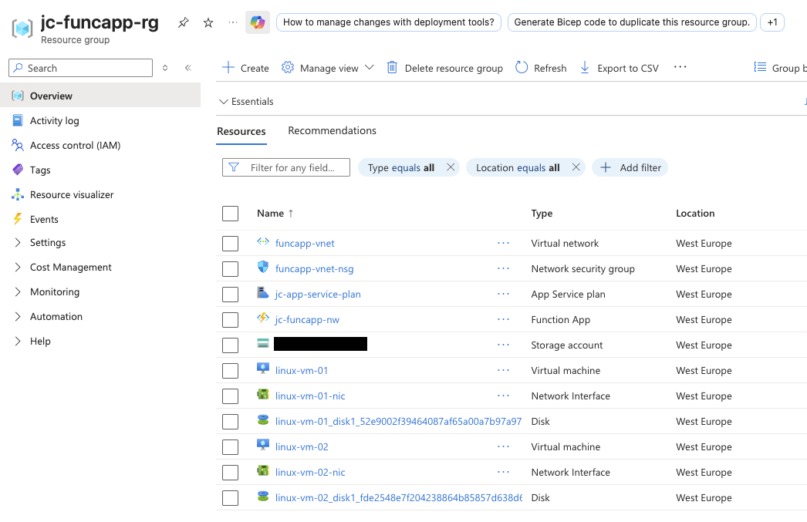

All infrastructure resources are provisioned via Terraform.

---

## VM Tags Applied

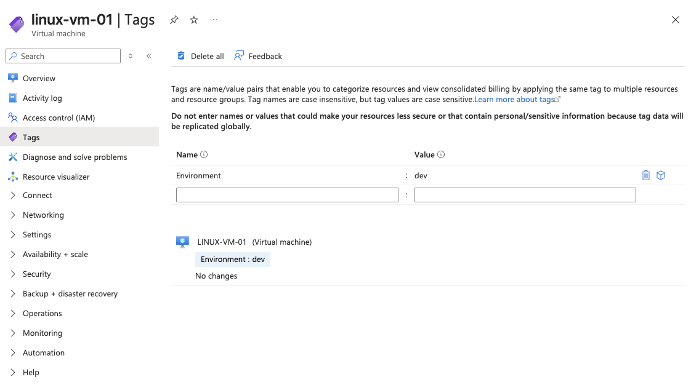

Virtual Machines are tagged (e.g., `Environment = dev`) to enable dynamic targeting by the automation function.

Tag-driven design ensures flexibility and scalability.

---

## Azure Function Overview

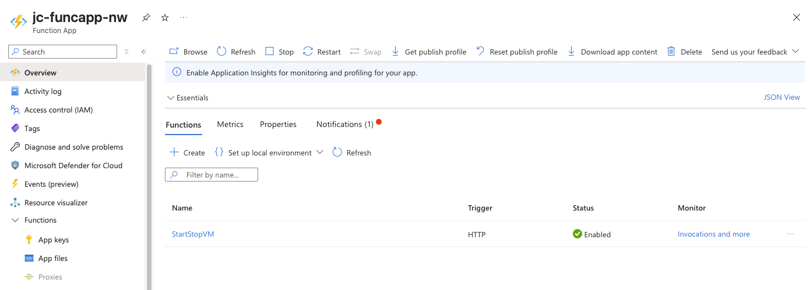

An Azure Function (PowerShell, HTTP-triggered) performs lifecycle operations based on:

- Action (start / stop)
- Provided tags

The HTTP trigger allows controlled, on-demand operational execution.

---

# 🔐 Security & Identity

## Managed Identity Enabled

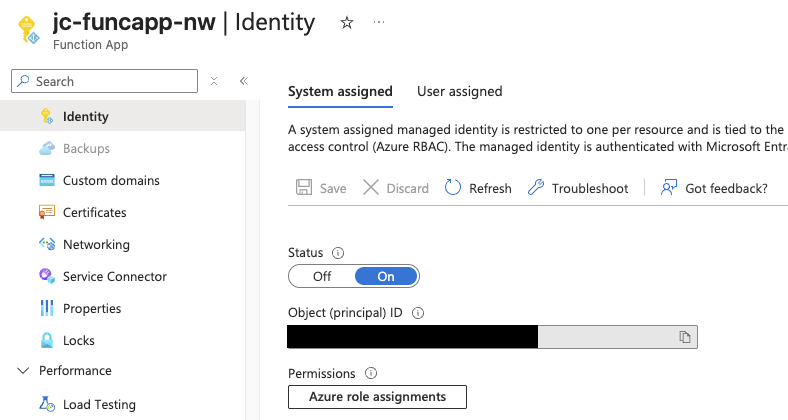

The Function App uses a **System-Assigned Managed Identity**, eliminating the need for stored credentials.

---

## RBAC – Least Privilege

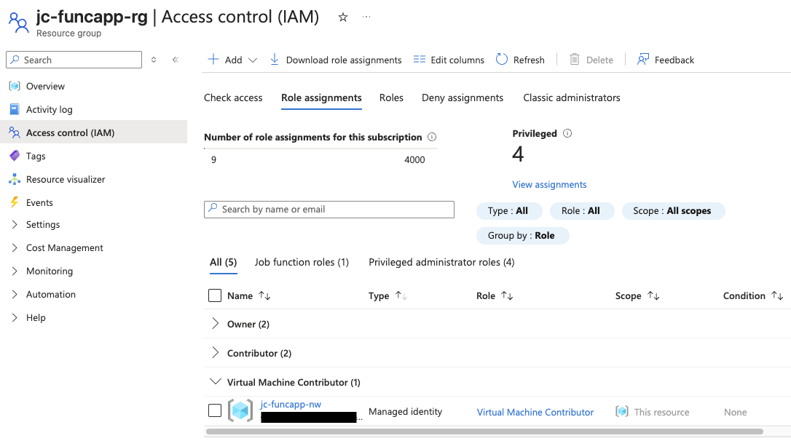

The Managed Identity is granted:

- **Virtual Machine Contributor**

Scoped appropriately to ensure least-privilege access.

No secrets or service principal credentials are stored in code.

---

# ⚙️ Function Logic & Automation

## PowerShell Automation Logic

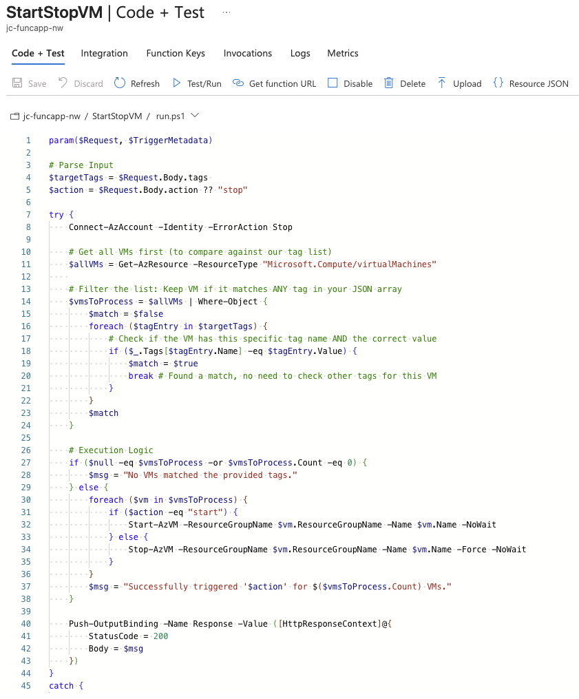

The function:

- Authenticates using `Connect-AzAccount -Identity`
- Retrieves VMs by tag
- Starts or stops them based on request payload

This approach enables scalable and dynamic automation.

---

## HTTP Trigger Execution

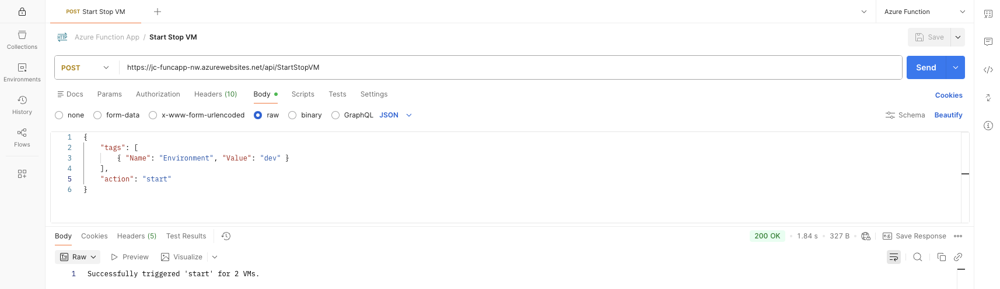

The function is triggered via HTTP POST request with a JSON payload:

```json
{
    "tags": [
        { "Name": "Environment", "Value": "dev" }
    ],
    "action": "stop"
}
```

This allows operational flexibility and integration with other systems if needed.

---

## Execution Logs

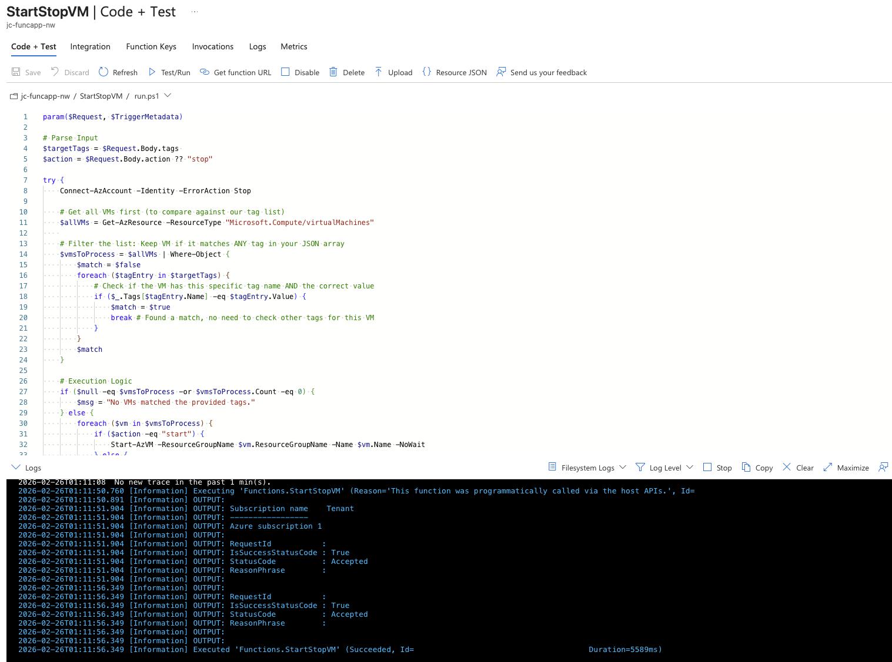

Azure Function logs confirm successful execution and VM lifecycle changes.

---

## VM State Change Verification

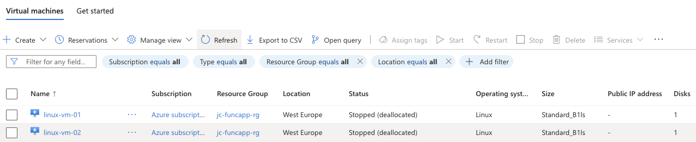

VM state transitions (Running ↔ Stopped) validate end-to-end functionality.

---

# 🚀 Performance Optimization

## PowerShell Module Optimization

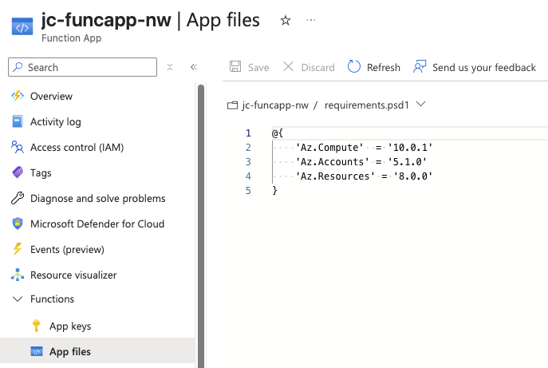

Instead of importing the full `Az` module set, only required modules are loaded:

- `Az.Compute`
- `Az.Accounts`
- `Az.Resources`

This reduces:

- Cold start time  
- Storage footprint  
- Unnecessary module loading  

This reflects production-aware optimization rather than default configuration.

---

# 🔄 Extensibility

While this implementation uses an HTTP trigger for controlled, on-demand operations, the same logic can easily be adapted to:

- Timer-based scheduled automation  
- Event-driven triggers  
- CI/CD integrations  

The architecture is intentionally designed to be extensible without redesigning the core logic.

---

# 🧠 Key Design Principles

- Infrastructure as Code (Terraform)
- Modular architecture
- Tag-driven automation
- Least privilege security
- Managed Identity authentication
- No hardcoded secrets
- Performance-aware implementation
- Business-aligned cost optimization

---

# 📎 Summary

This project demonstrates more than automation.

It reflects:

- Secure cloud engineering practices  
- Modular Terraform architecture  
- Cost-aware infrastructure management  
- Production-minded implementation decisions  

The focus was not just technical functionality, but building a maintainable and extensible automation pattern aligned with real-world operational needs.